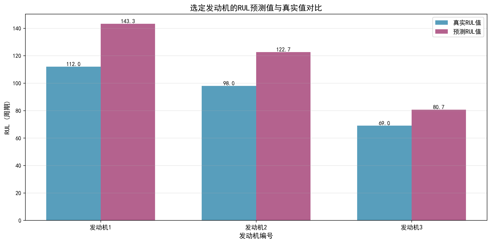
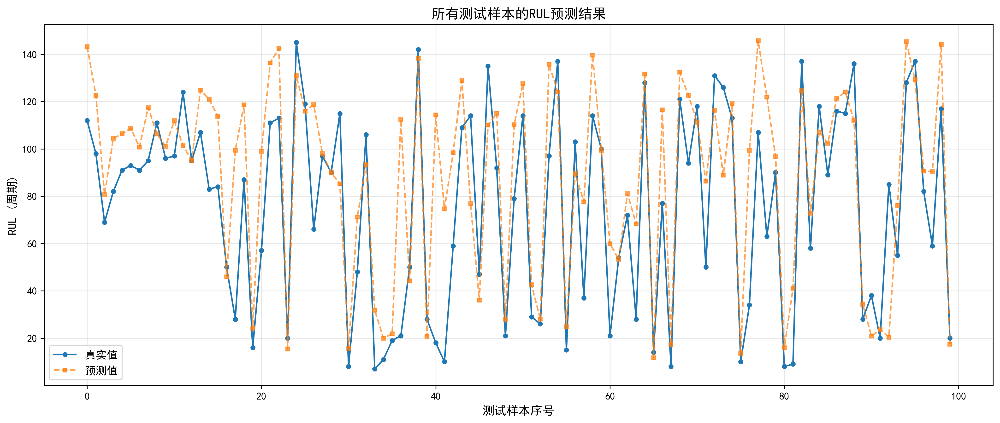

<div align="center">

# ✈️ Engine-RUL-Prediction

### LSTM remaining-useful-life prediction on NASA C-MAPSS.

Predict aero-engine remaining useful life from 21 sensors — a full ML pipeline from features to visualization.

[](LICENSE)
[](https://www.python.org/)
[](https://pytorch.org/)
[](https://www.tensorflow.org/)

</div>

---

**Engine-RUL-Prediction** builds an **LSTM-based remaining-useful-life (RUL) prediction** system for aero-engines using the **NASA C-MAPSS** dataset. It fuses 21 sensor signals over 30 time steps to forecast remaining life, reaching **RMSE 28.54 cycles / MAE 21.13 cycles** (~70% accuracy), enabling predictive maintenance.

> [!NOTE]
> 中文项目：基于 LSTM 的航空发动机剩余使用寿命（RUL）预测——NASA C-MAPSS 数据集，21 传感器 + 30 时间步，RMSE 28.54。

---

## Dataset

| Split | Records | Engines | Sensors |
|-------|---------|---------|---------|
| Train | 20,631 | 100 | 21 |
| Test | 13,096 | 100 | 21 |

Input: 21 sensors × 30 time steps. Output: remaining cycles.

---

## Features

- **LSTM model** — captures long-term dependencies in multi-sensor time series (RMSE ≤ 30 target).
- **Automated feature fusion** — 21-sensor data engineered and fused automatically.
- **Predictive maintenance** — from reactive to on-demand maintenance.
- **5 visualizations** — time series, correlation heatmap, distribution, prediction comparison, all-predictions.
- **Deployable** — clean pipeline from data to model to plots.

---

## Quickstart

```bash
git clone https://github.com/Windyhhh/Engine-RUL-Prediction.git
cd Engine-RUL-Prediction

pip install -r requirements.txt

python src/main.py          # train & evaluate
python src/visualization.py # generate the 5 charts
```

Plots land in `results/` (01_time_series … 05_all_predictions).

---

## Project Structure

```
Engine-RUL-Prediction/
├── src/
│   ├── main.py            # entry
│   ├── rul_prediction.py  # LSTM model + training
│   └── visualization.py   # charts
├── data/                  # C-MAPSS FD001 (train/test/RUL)
├── results/               # 5 visualizations
└── docs/                  # usage, design, results
```

---


## Results

<div align="center">
  
  
</div>

---
## License

MIT — free to use, modify and distribute.
